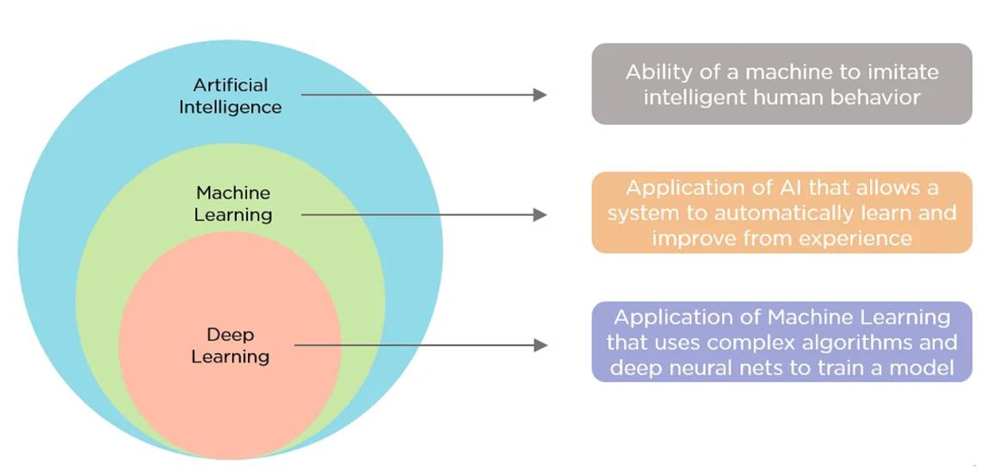
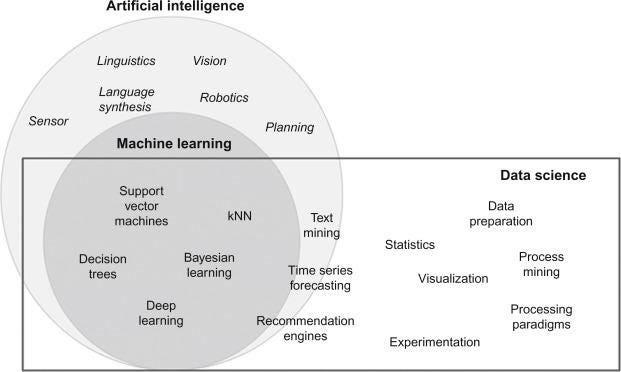
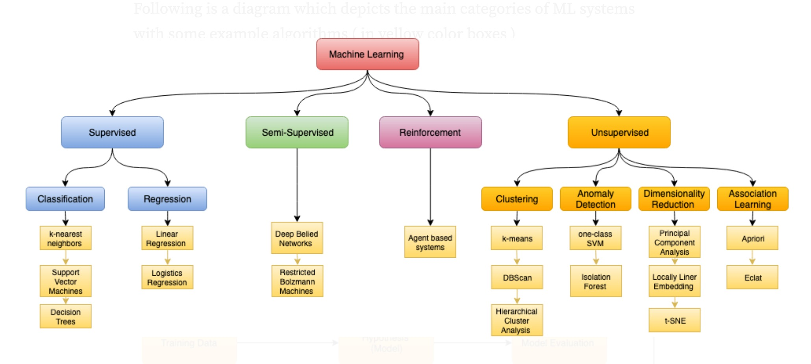

# L1 - Intro

## Several Concepts

- **Data**
- **Data Science**: An interdisciplinary field that uses algorithms, procedures, and processes to examine large amounts of data to uncover hidden patterns, generate insights, and direct decision making.
- **Data Mining**: The process of extracting and discovering patterns in large data sets.
- **AI**: A machine's ability to perform the cognitive functions we associate with human minds, such as reasoning, learning, interacting with an environment, problem-solving, and even exercising creativity.
- **Machine Learning**: A branch of AI and computer science that focuses on the use of data and algorithms to imitate the way that humans learn, gradually improving its accuracy.

## Relationships of the Concepts

1. General

</img>

2. Deep Learning $\subset$ Machine Learning $\subset$ AI

</img>

3. Data Science $\neq$ AI

</img>

## Machine Learning

</img>

1. **Supervied**
   1. Classification: K-Nearest Neighbors -> Support Vector Machines -> Decision Trees
   2. Regression: Linear Regression -> Logistics Regression
2. **Semi-Supervised**: Deep Bulled Networks -> Restricted Bolzmann Machines
3. **Reinforcement**: Agent Based Systems
4. **Unsupervised**
   1. Clustering: K-Means -> DBScan -> Hierarchical Cluster Analysis
   2. Anomaly Detection: One-Class SVM -> Isolation Forest
   3. Dimensionality Reduction: Principal Component Analysis -> Locally Linear Embedding -> t-SNE
   4. Association Learning: Apriori -> Eclat

(We don't focus on Semi-Supervised Machine Learning)