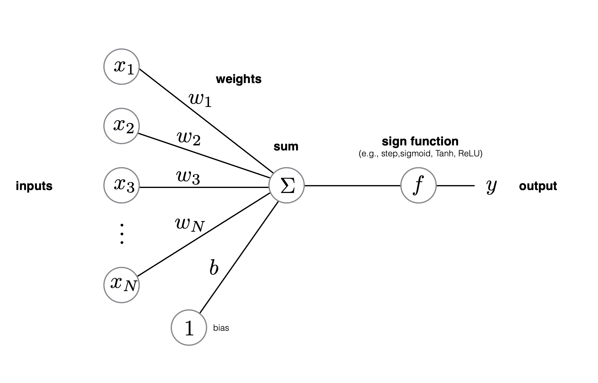
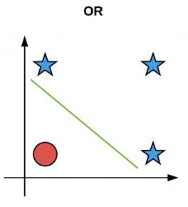
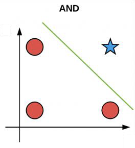
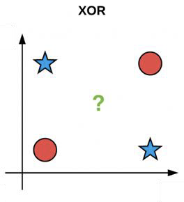
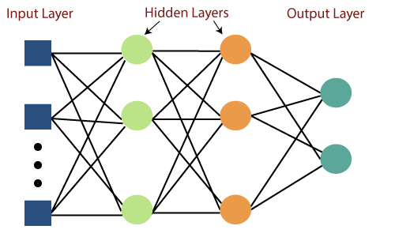
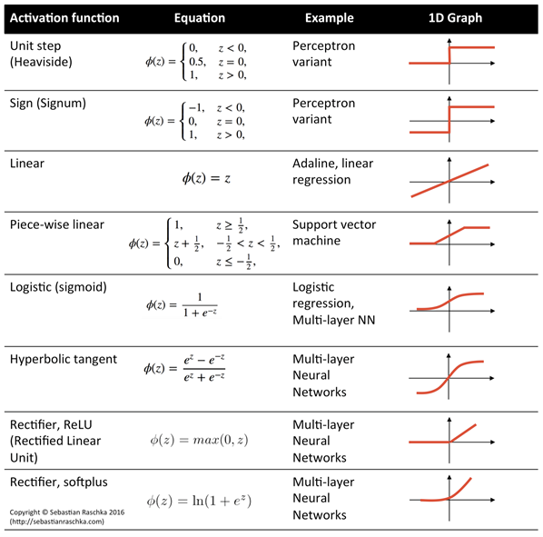

# L10 - The Perceptron and Neural Networks

## Perceptron

- Weights: Each input feature has a corresponding weight that indicates its importance. Can be adjusted during training to improve the models accuracy.
- Bias: An additional parameter that allows the model to shift the decision boundary, providing more flexibility in the classification.
- Inputs: The features of the data you want to classify or pridict.
- Weighted Sum: The perceptron calculates a weighted sum of the inputs and the weights, adds the bias, and then applies an activation function.
- Activation Function: Introduce non-linearty into the model, allowing neural networksto learn complex patterns. e.g. step function.

### How does Perceptron Learn?

During training, the perceptron adjusts its weights and bias based on the errors in its predictions, improving it's ability to classify data accurately.

This process is done using a trchnique called the perceptron learning algorithm.

### Perceptron Learning Theorem

- A perceptron (artificial neuron) can learn anything that it can represent (i.e. anything separable with a hyperplane)

- A perceptron cannot represent XOR since it's not linearly separable.

	

    
    
    
  

### Multi-Layer Perceptron (MLP)

More complex problems may require intermediate layers.

- XOR problem
  $$
  \text{XOR}(X,Y) = \text{AND}(\text{NOT}(\text{AND}(X,Y)), \text{OR}(X,Y))
  $$

- Multiple Layers
  - 1st layer draws linear boundaries
  - 2nd layer combines the boundaries
  - 3rd layer can generate arbitrarily complex boundaries

## Training Neural Networks

### Backpropagation

- Backpropagation: Iteratively adjusted the components that influence the output of a neuron (bias, weights, activations) to reduce the cost function.
- Lots of derivative calculations: 
  - With respect to the cost function (weights, biases and previous layer activations) to identify which values affect the gradient of the cost function. 
  - In each iteration, the weights in the network are updated by the calculated gradient and thus controls the factor of modification made to weight values.
  - The weights are adjusted in the direction that minimises the cumulative error from all the training data points, using techniques such as gradient descent.
- The decision boundary perspective

### Activate Function $f$

- If $f(x)$ is non-linear, a network with $1$ hidden later can theoretically learn any classification problem.
- A set of weights exists that can produce the targets from the inputs.
- The problem is finding them.

### Possible Activation Functions

## Conclusion

### ANN vs SVM

- ANN use non-linear activate function, so they can draw complex boundaries but keep the data unchanged.
- SVM's only draw straight lines, but they transform the data first in a way that makes that OK.

### Types of Neural Networks

1. Convolutional Neural Networks (CNNs): Standard in DL-based approcaches to computer vision and image processing (also NLP and time series)
2. Recurrent Neural Networks (RNNs): used for sequential data processing (text, speech, time series). They have a vanishing fradient problem which was solved by the invention of Long Short-Term Memory (LSTMs)
3. Transformers: developed by Google, can be applied in almost everything from NLP to RL, also led to the development of pretrained models such as BERT and GPTs.

### Disadvantages of Neural Networks

- The variables are not developed by engineering judgement, so the model tends to be a black-box or input / output table without an analytical basis.
- The sample size has to be large.
- Require lots of trials and errors, so training can be time-cosuming.