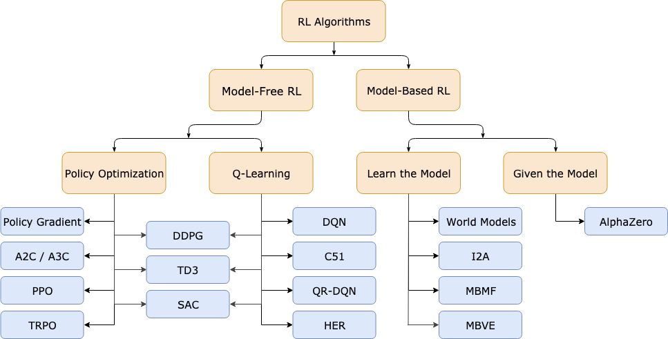

# L11 - Introduction to Reinforcement Learning

**Main Branches of Machine Learning**

1. Supervised Learning: Predictions from labeled data
2. Unsupervised Learning: Patterns in unlabeled data
3. Reinforcement Learning: Optimal decisions from experience

## Introduction

- Agent
  - Receives an observation of the current state
  - Selects an action
  - Receives a reward from the environment
- Environment
  - Receives an action from the agent
  - Gives a reward to the agent
  - Changes the environment state
- Goal: Learning to make Optimal Sequences of decisions in an unknown environment by **Trial and Error**

- Features
  - Reinforcement Learning (make good decisions from experience) vs Other machine Learning Tasks (make good predictions from data)
  - No supervisor to follow, only a scalar reward signal
  - Feedback can be delayed
  - Agent's behavior affects the subsequent data

## Main Characteristics of RL

### Optimization

Suppose states-$S_t$, rewards-$R_t$ and actions-$a_t$, where $t$ means the $t$-th step.

#### Goal 

maximize
$$
\sum_{t=1}^T R_t
$$
or
$$
\sum_{t=1}^T \gamma^t R_t
$$
subject to function $\pi(\cdot)$
$$
\begin{aligned}
\pi:\text{state}&\to\text{action} \\
S_t &\mapsto a_t
\end{aligned}
$$

- Optimize some well-defined and measurable objective
- Reward is an engineering decision: This is how we tell the AI agent to focus on
- Changing the rewards changes the policy that the agent learns

### Exploration vs Exploitation

- Exploration focuses on gaining more knowledge about the environment.
- Exploitation focuses on using existing knowledge to maximize rewards.

### Delayed Reward

- Greedy: Immediate Reward
- Patient: Delayed Reward

### Generalization

Impossible to try all state and action pairs $(S_t, a_t)$. Need to generalize from limited samples.

## Markov Decision Process

A mathematics model for dealing with problems with uncertainty.

1. Policy: $a\sim\pi(x)$ with distribution $p^\pi(a|s)$

2. Reward $R_t$: 
   $$
   r(s,a) = E\left[R_{t+1}\mid s_t=s, a_t=a\right]
   $$

3. Value:
   $$
   V^\pi(x) = E\left[\sum_{t=0}^\infty R_t\mid s_0=s\right]
   $$
   
4. Action-Value (Q-Value)
   $$
   Q^\pi(s,a) = E\left[\sum_{t=0}^\infty R_t\mid s_0=s, a_0=a\right]
   $$

### Dynamic Programming

**Used when knowing dynamics and rewards.**

- Know

  - $p(s_{t+1}, R_{t+1}\mid s_t, a_t)$
  - $r(s,a)$

- Goal: Learn optimal policy

  - $\pi(\cdot)$
  - $p^\pi(a\mid s)$

- Optimal Bellmann Equation
  $$
  V^*(s) = \max_a{r(s,a)}+\sum_{s'} p\left(s'\mid s, a\right)V^*(s')
  $$

#### Steps

1. Value Iteration

   1. Initialize value function $\hat{V}_0(s)$ for all $s$

   2. Iterate for $i=1,2,3,\cdots$, for $s\in S$
      $$
      \hat{V}_{i+1} (s) = \max_a{r(s,a)}+\sum_{s'}p\left(s'\mid s,a\right)\hat{V}_i(s')
      $$

2. Converges to $V^*(\cdot)$
   $$
   \lim\limits_{i\to\infty}\hat{V}_i(\cdot) = V^*(\cdot)
   $$

3. Optimal Policy
   $$
   \pi(s) = \arg\max_a{r(s,a)} + \sum_{s'}p\left(s'\mid s, a\right)\hat{V}_{\text{end}}(s')
   $$

**Problem: We usually don't know the dynamics or the rewards.**

### Q-Learning

**Used when not knowing dynamics or rewards.**

- Do not know

  - $p\left(s_{t+1}, R_{t+1}\mid s_t, a_t\right)$
  - $r(s,a)$

- Goal: Learn optimal policy

  - $\pi(\cdot)$
  - $p^\pi(a\mid s)$

- Optimal Action Value Function
  $$
  Q^*\left(s,a\right)=r(s,a)+\max_a{\sum_{s'}p\left(s'\mid s\right)}Q^*\left(s', a'\right)
  $$

#### Steps

1. Q Learning

   1. Initialize value function $\hat{Q}(s,a)$ for all $s$ and $a$

   2. Choose initial state $s_0$

   3. Iterate for $t=1,2,3,\cdots$

      1. Choose action $a$ from $\hat{Q}$ (e.g. $\epsilon$-greedy chooses a random action with probability $\epsilon_i$, other $a=\arg \max_a{\hat{Q}(s,a)}$)

      2. Take action $a$ and observe $r(s,a)$ and $s'$
         $$
         \hat{Q}\left(s,a\right) = \hat{Q}\left(s,a\right)+\alpha\left[r(s,a)+\max_{a}{\hat{Q}\left(s',a'\right)}-\hat{Q}\left(s,a\right)\right]
         $$

2. Converges to $Q^*(\cdot)$
   $$
   \lim\limits_{t\to\infty}{\hat{Q}(\cdot)} = \hat{Q}(\cdot)
   $$

3. Optimal policy
   $$
   \pi(s) = \arg\max_a{\hat{Q}\left(s,a\right)}
   $$

**Challenge: State / Action-Spaces are usually huge.**

## Deep RL

- State-spaces often huge
- State-spaces grows exponentially with features
- Cannot learn $Q^*(s,a)$ by trying all state-action pairs

- Solution: Use deep neural network as an approximator function

### Value Learning

Find $Q(s,a)$, $a=\arg\max_a{Q(s,a)}$

#### Deep Q Networks (DQN)

?

#### Training DQN

?

#### Summary

##### Downsides of DQN

- Complexity
  - Can model scenarios where the action space is discrete and small
  - Cannot handle continuous action spaces
- Flexibility
  - Policy is deterministically computed from the Q function by maximizing the reward $\Rightarrow$ cannot learn stochastic policies

### Policy Learning

Find $\pi(s)$, sample $a\sim\pi(s)$

#### Key Idea

- DQN: Approximate Q-function and use to infer the optimal policy

  

- Policy Gradient: Directly optimize the policy $\pi(s)$

  

#### Discrect vs Continuous Action Spaces

- Discrete Action Space: which direction should I move?

  

- Continuous Action Spaces: How fast should I move?

  

#### Policy Gradient (PG) - Reinforce

**Enables modeling of continuous action space**

## Conclusions

A Taxonomy of Deep RL Algorithms

#### Model-Free vs Model-Based RL

whether the agent has access to (or learns) a model of the environment

#### Value-Based vs Policy-Based Algorithms

- Value Based Methods: Approximate the expected total rewards from state
- Policy-Based Methods: (in this family) represent a policy explicitly
- Some methods use both value and policy based functions (e.g. Actor Critic)
