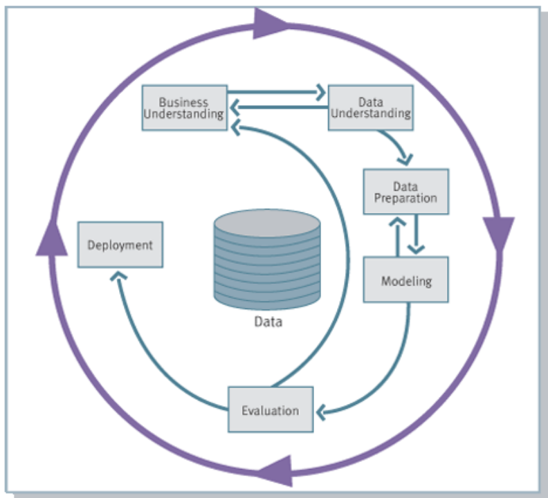
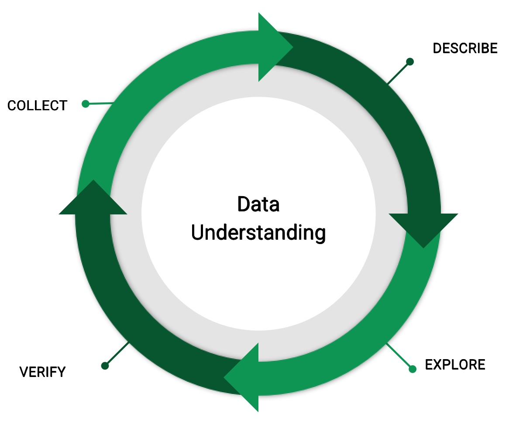
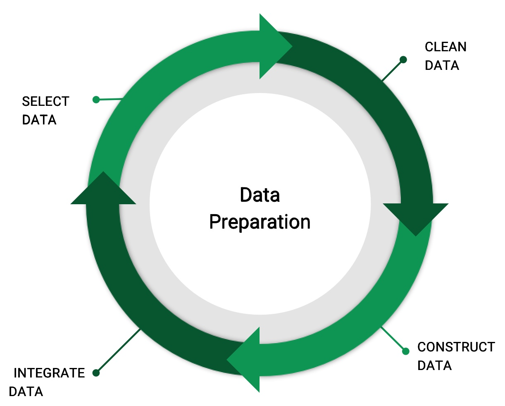

# L2.1 - CRISP-DM

</img>

## Business Understanding

- Determine Business Objectives
- Assess the Situation
- Determine Project Goals
- Create a Project Plan

## Data Understanding

</img>

Collect -> Describe -> Explore -> Verify -> ...

### Step 1 - Collet and Intergrate Data

Several Sources, Time Demanding

### Step 2 - Describe Data

Type, Format, Quantity, Number of Records, Identities, ...

Numerical, Categorical, Time-Series, Text, Image, ...

### Step 3 - Explore Data

Querying, Verification, Reporting, ...

### Step 4 - Verify Data Quality

## Data Preparation

</img>

Select -> Clean -> Construct -> Integrate -> ...

### Step 1 - Select Data

- Which data wil be used for analysis?
- Quality and Technical Constrains
- Choose Attribute
- Be Able to Explain

### Step 2 - Clean Data

- Removing Unwanted Data
- Missing Data Handling
- Structural Error Solving
- Outliers Management

### Step 3 - Construct Data (Transformation / Engineering)

- Developing Entirely New Records / Producing Derived Attributes
- Ease the Model Process / Facilitate the Modeling Algorithm
- Modeling Tools / Algorithms Requires these Transformation

## Modelling

- Machine Learning

## Evaluation

How to evaluate the performance of a model?

- **Methods** for Performance Evaluation
- **Metrics** for Performance Evaluation

How to compare the relative performance of different models?