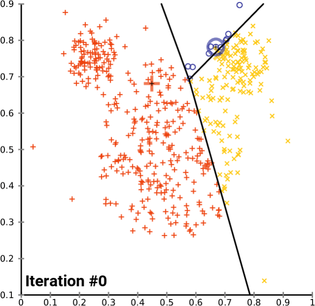
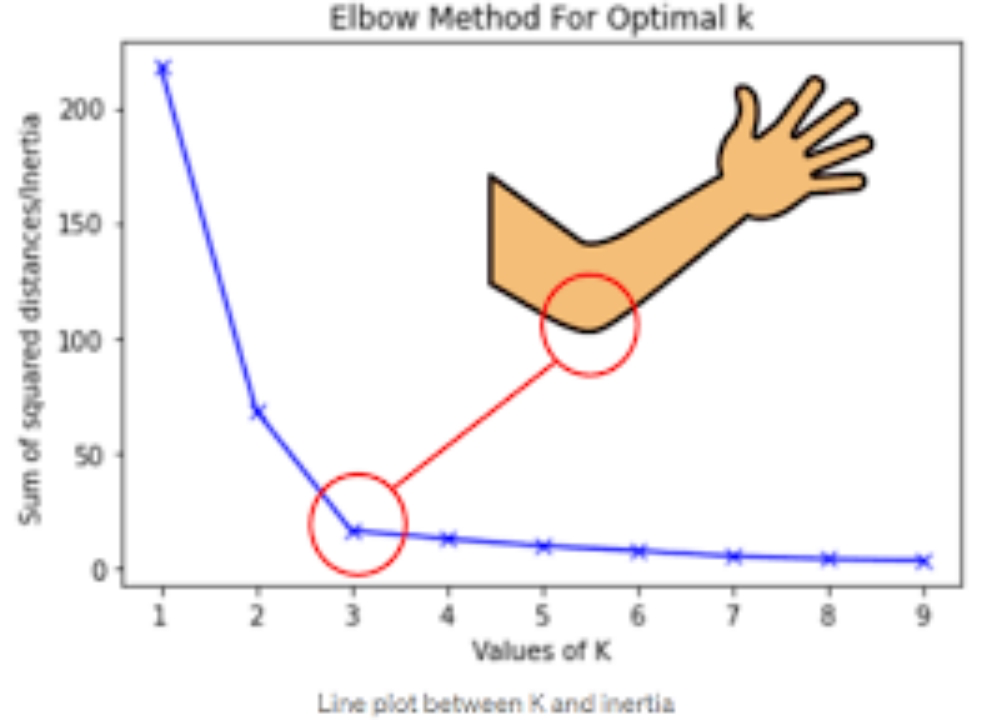
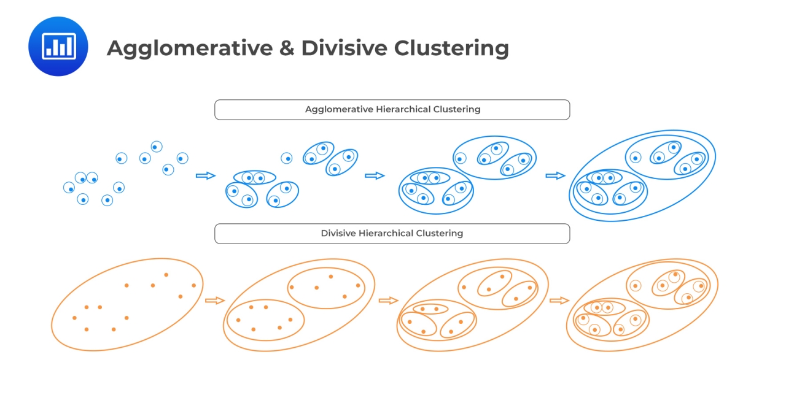
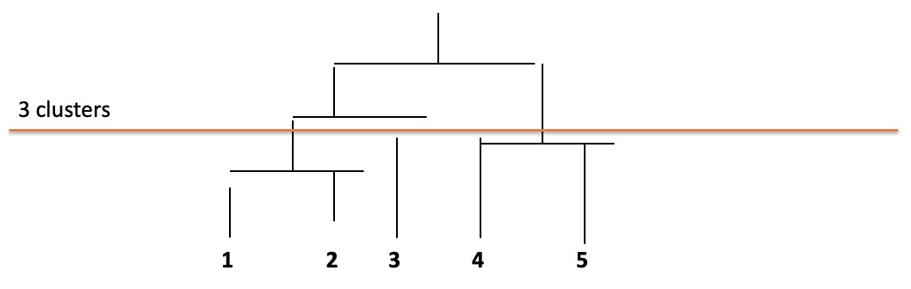
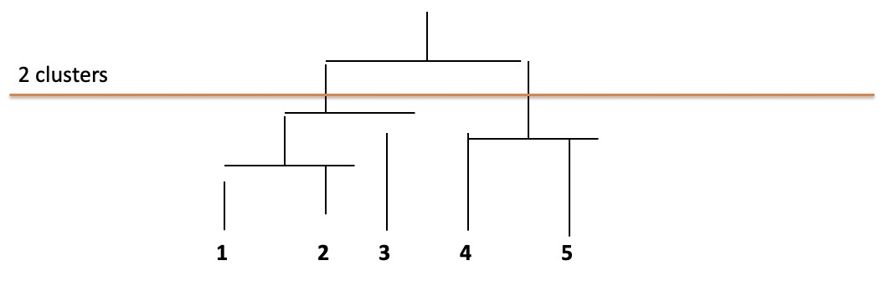
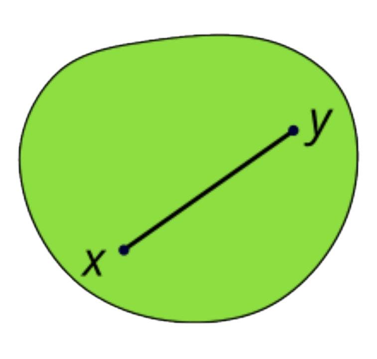
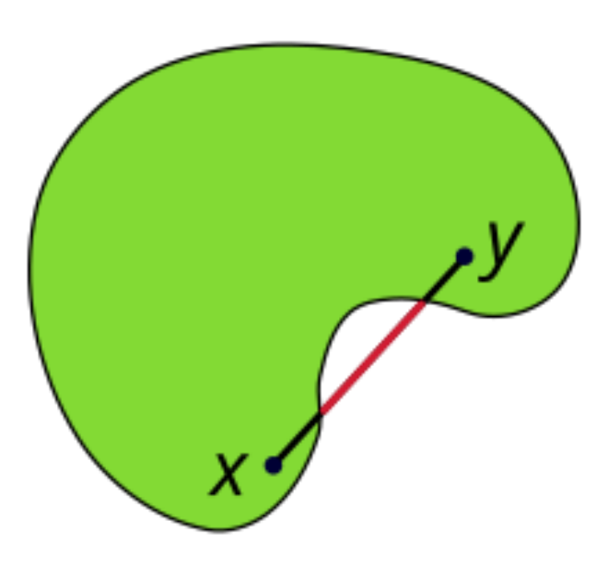
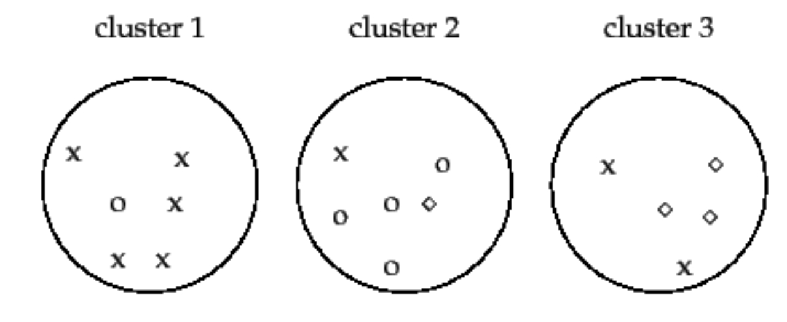

# L5 - Clustering

## Types

| Clustering Algorithm Type | Clustering Methodology                                       | Algorithm(s)                                         | Notes                                                        |
| ------------------------- | ------------------------------------------------------------ | ---------------------------------------------------- | ------------------------------------------------------------ |
| Centroid-based            | Based on proximity to centroid                               | KMeans, KMeans++, KMedoids                           | These methods partition the data into a predefined number of clusters. |
| Connectivity-based        | Based on proximity between clusters                          | Hierarchical Clustering (Agglomerative and Divisive) | Build a hierarchy of clusters either by starting with individual data points and merging (agglomerative) or starting with all data points and splitting (divisive) |
| Density-based             | Based on their density instead of proximity                  | DBSCAN, OPTICS, HDBSCAN                              | Identify clusters based on the density of data points in the feature space. They are effective at finding clusters of arbitary shapes and handling noise. |
| Graph-based               | Based on graph distance                                      | Affinity Propagation, Spectral Clustering            |                                                              |
| Distribution-based        | Based on their likelihood of belonging to the same distribution | Gaussian Mixture Models (GMMS)                       |                                                              |
| Compression-based         | Transform data to a lower dimensional space and then perform clustering | BIRCH                                                |                                                              |

## Requirements

1. Proximity Measure
   1. Similarity Measure $S(x_i, x_j)$: large if $x_i$ and $x_j$ are similar
   2. Dissimilarity Measure $D(x_i, x_j)$: small if $x_i$ and $x_j$ are similar
2. Criterion Function for Cluster Evaluation
3. Algorithm to Compute Clustering

## Distance Measure

| Distance Measure Name | Formula                                        | Norm       |
| --------------------- | ---------------------------------------------- | ---------- |
| Euclidean Distance    | $d(x,y) = \sqrt{(x_1-y_1)^2+(x_2-y_2)^2}$      | $L^2$-Norm |
| Manhattan Distance    | $d(x,y)=|x_1-y_1|+|x_2-y_2|$                   | $L^1$-Norm |
| Minkowski Distance    | $d(x,y)=(\sum_{i=1}^d|x_i-y_i|^p)^\frac{1}{p}$ | $L^p$-Norm |

## Centroid-Based

### $K$-Means Clustering

#### Steps

1. Select the number $K$, the number of clusters

2. Select random $K$ points / centroids

3. Assign each data point to their closest centroid using Euclidean distance, which will form the predefined $K$ clusters

4. Calculate the variance and place a new centroid of each cluster (within-cluster sum of squares)

5. Repeat step 3 and 4

   

#### Cost Function

Within-Cluster Sum of Squares (WCSS): 
$$
\text{Cost}(C) = \sum_{i=1}^K\sum_{x\in C_i}(x-c_i)^2
$$

- The algorithm iteratively updates the centroids and assignments to minimize this cost function, leading to more coherent clusters with smaller within-cluster variance
- This effectively aims to make clusters as compact and as distinct from each other as possible
- A lower WCSS idicates that data points are closer to their cluster centroids, suggesting that the clusters are more homogeneous and the clustering is more effective.

#### Advantages

- Easy
- Computationally Efficient
- Works well with large datasets
- Cluster Centers are meaningful

#### Weaknesses

- Only applicable when mean is defined (categorical data like gender / hair color / ... should use $K$-Modes (Most frequent values))
- The number of clusters needs specifying
- Sensitive to outliers
- Sensitive to initial seeds

#### Choose the number $K$

Find the "elbow point":

- Run $K$-means clustering for a range of $K$ values (e.g., from $1$ to $10$)
- For each $K$, compute the WCSS
- Plot the WCSS values against the number of clusters $K$
- Look for the "elbow point" in the plot where the rate of decrease in WCSS slows down

### $K$-Medoids Algorithm

Medoid: a central data point within a cluster that is chosen to represent that cluster.

Unlike the centroid in $K$-means clustering, which is the mean of all points in a cluster and may not necessarily be an actual data point, a medoid is an actual data point from the dataset.

It is the point that has the smallest total distance to all other points in its cluster.

Similar to $K$-Means Clustering

- Choose random $K$ medoids from the original dataset $X$
- Assign Each of the $n-K$ remaining points in $X$ to their closest medoid.
- Iteratively replace one of the medoids by one of the non-medoids if if improves the total clustering cost ??? Improve ? Decrease ?

## Connectivity-Based

### Hierarchical Clustering ($=$ agglomerative clustering $+$ divisive clustering)

- Produces a set of nested clusters organized as a hierarchical tree.
- Can be visualized as a dendrogram, a tree-like diagram that records the sequences of merges or splits.
- Two main types:
  1. Agglomerative (Bottom-Up)
     - Start with the points as individual clusters
     - At each step, merge the closest pair of clusters until only one cluster left.
  2. Divisive (Top-Down)
     - Start with one, all-inclusive cluster
     - At each step, split a cluster until each cluster contains a point

- Traditional hierachical algorithms use a similarity of distance matrix
- Merge or split one cluster at a time

#### Agglomerative Clustering

Clustering Algorithm based on distances between observations (not distances from centroids)

| Linkage Type     | Formula                                                      | Strength                                         | Limitation                       |
| ---------------- | ------------------------------------------------------------ | ------------------------------------------------ | -------------------------------- |
| Single Linkage   | $d_{12} = \text{min}_{i,j}d(X_i, Y_j)$                       | Can handle non-elliptical shapes                 | Sensitive to noise and outliers  |
| Complete Linkage | $d_{12} = \text{max}_{i,j}d(X_i, Y_j)$                       | Less susceptible to noise and outliers           | Tends to break large clusters    |
| Average Linkage  | $d_{12} = \frac{1}{Kl}\sum_{i=1}^K\sum_{j=1}^l d\left(X_i, Y_j\right)$ | Also dose well in separating clusters with noise | Biased towards globular clusters |

- Use single linkage
  $$
  d_{12} = \text{min}_{i, j} d(X_i, X_j)
  $$
- Example: Single Linkage
  $$
  \begin{bmatrix}
  0 & & & & \\
  2 & 0 & & & \\
  6 & 3 & 0 & & \\
  10 & 9 & 7 & 0 & \\
  9 & 8 & 5 & 4 & 0
  \end{bmatrix}
  $$
  
- Then the following distances:
  $$
  \begin{aligned}
  d_{(1,2), 3} &= \text{min}\{d_{1,3}. d_{2,3}\} = \text{min}\{6,3\} = 3 \\
  d_{(1,2), 4} &= \text{min}\{d_{1,4}. d_{2,4}\} = \text{min}\{10, 9\} = 9 \\
  d_{(1,2), 5} &= \text{min}\{d_{1,5}. d_{2,5}\} = \text{min}\{9,8\} = 8
  \end{aligned}
  $$
  
- Finding the correct number of clusters: Choose a view of the dendrogram that provides the highest aaverage value of the chosen evaluation metric (e.g. Silhouette Score)

  

  

## Convex vs non-Convex Cluster Shape

**Convex Cluster**: Illustration of a convex set shaped like a deformed circle. The line segment joining points $x$ and $y$ lies completely within the set, illustrated in green. Since this is true for any potential locations of two points within the set, the set is convex.

**non-Convex Cluster**: Illustration of a non-convex set. The line segment joining points $x$ and $y$ partially extends outside of the set, illustrated in red, and the intersection of the set with the line occurs in two places, illustrated in black.

## Density-Based

### DBSCAN

DBSCAN is a density-based algorithm it locates regions of high density that are separated from one another by regions of low density

- **Density**: number of points within a specified radius (Eps)
- **Core Point**: A point is a core point if it has more than a specified number of points (MinPts) within a radius of $\epsilon$ (including itself)
- **Border point**: has fewer than MinPts within $\epsilon$, but is in the neighborhood of a core point  
- **Noise Point**: A noise point is any point that is neither a core point or a border point.

Border points and noise points are at the interior of a cluster 

#### Advantages

1. Resistant to noise
2. Can handle clusters of different shapes and sizes

#### Disadvantages

1. Cannot handle varying densities
2. Sensitive to parameters

## How good is a clustering?

- Several Metrices for assessing the quality of a cluster.
- External Evaluation: Employ criteria not inherent to the clusters (e.g. )
- Internal Evaluation: Employ criteria that are derived from the data itself (e.g. )

### Internal Evaluation

- The clustering is evaluated based on merely the data that was used for the clustering
- Metrics in the category typically assess the intra-clusterinter-cluster similarities.
- e.g. 
  - Silhouette Coefficient
  - Davies-Bouldin Index
  - Dunn Index

#### Silhouette Score

- $a(i)$: Average dissimilarity (Distance) of object $i$ to all other people from the same cluster.

- $b(i)$: Lowest average dissimilarity (Distance) of object $i$ to any other object for every cluster where $i$ is not a member.

- The Silhouette of object $i$:
  $$
  s(i) = \frac{b(i)-a(i)}{\text{max}\{a(i), b(i)\}}
  $$

- Takes values between $-1$ to $1$

  - If $b(i)\gg a(i)$ then $s(i)=1$
  - If $b(i) \ll a(i)$ then $s(i)=-1$

- Total Silhouette: average silhouette value of all objects

### External Evaluation

- Clustering is evaluated based on external information, e.g. class labels
- Metrics in this category typically assess how close is the clustering to the predefined classes
- e.g. 
  - Purity
  - Rand Index
  - Jaccard Index
  - Mutual Information

### Cluster Purity

- Each cluster is assigned to the class label that is most frequent in the cluster.
- Purity is masured by counting the number of correctly assigned objects and dividing by the total number of objects.

$$
\text{Purity} = \frac{5+4+3}{17}=\frac{12}{17}=0.71
$$

- Cluster Purity:
  - simple
  - intuitive
- Trade-off between number of clusters and purity?
  - If each object belongs to its own cluster, then purity is $1.0$
  - Desirable?
- Cannot trade-off the quality of clusters against the number of clusters
- Alternatives:
  - Hard Index
  - Normalized Mutual Information

### Cluster Evaluation (Hard)

- Intra-cluster cohesion (compactness): measures how near the data points in a cluster are to the clister centroid
- Inter-cluster separation (isolation): Separation means that different cluster centroids should be for away from on another
- In most applications, expert judgements are still the key
