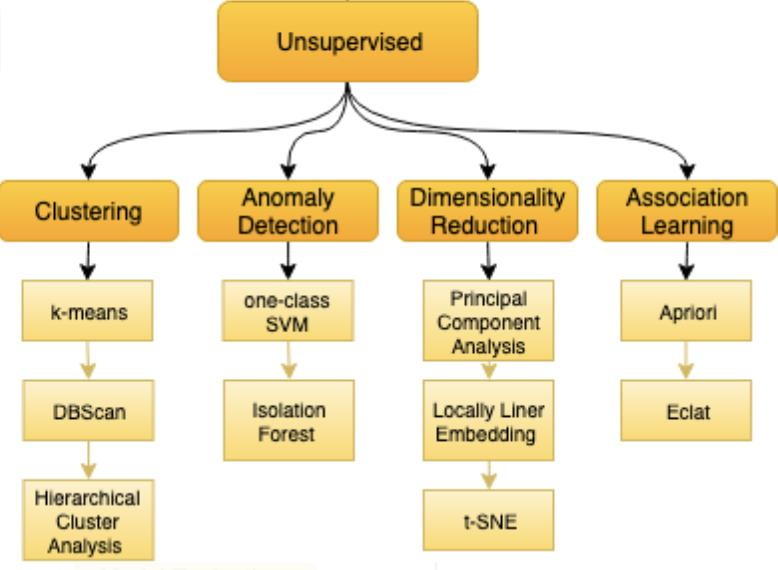
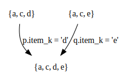

# L6 - Association Rule Mining

Applications:

- Marketing and Cross Selling
- Product Placement
- Customer Behavior and Recommendation Engines

Benefits:

- Increase Sales and Conversion Rates for Businesses
- Discovery of New Products for Customers
- Improved Customer Experience and Satisfaction
- Reduced Card Abandonment
- Better Upselling and Cross-Selling Oppotunities

## Unsupervised Learning



Experience: Objects for which no class labels have been given performance.

Characterizations (or grouping) of objects

## Definitions

- **Itemset**:
  - A set of one or more items
  - e.g. $\{\text{Milk}.\text{Bread}, \text{Diaper}\}$
  - $k$-itemset: an itemset containing $k$ items
- **Absolute Support**:
  - Number of transcations in which an itemset appears
  - e.g. $\sigma(\{\text{Milk}, \text{Bread}, \text{Diaper}\}) = 2$
- **Relative Support**:
  - Fraction of the transcations in which an itemset appears
  - e.g. $s(\{\text{Milk}, \text{Bread}, \text{Diaper}\}) = \frac{2}{5}$
- **Frequent Itemset**:
  - An itemset whose relative support is greater than or equal to a **minsup** threshold
- **Rule**
  - Let $D$ be a database of transactions. 
  - Let $I$ be the set of items that appear in the database, e.g. $I=\{A, B, C, D, E, F\}$
  - A rule is defined by $X\to Y$ where $X,Y\subset I$ and $X\cap Y=\emptyset$, e.g. $\{B, C\}\to\{A\}$ is a rule


## Problem 1 - Mining Frequent Itemsets

Given a set of transcations $D$, find combinations of items that occur frequently. 

- Task: Given a transaction database $D$ and a minsup threshold, find all frequent itemsets and the frequency of each set in this collection
- Stated Differently: Count the number of times combinations of attributes occur in the data. If the count of a combinsation is above minsup, report it.
- Recall: The input is a transaction database $D$ where every transaction consists of a subset of items from some universe $I$
- Given $d$ items, there are $2^d$ possible itemsets (including null).

Example Data:

| TID  | Items                     |
| ---- | ------------------------- |
| 1    | Bread, Milk               |
| 2    | Bread, Diaper, Beer, Eggs |
| 3    | Milk, Diaper, Beer, Coke  |
| 4    | Bread, Milk, Diaper, Coke |
| 5    | Bread, Milk, Diaper, Coke |

Example of frequent itemsets: 

1. $\{\text{Diaper}, \text{Beer}\}$
2. $\{\text{Milk},\text{Bread}\}$
3. $\{\text{Beer}.\text{Bread},\text{Milk}\}$

### Brute-Force Algorithm for Finding all Frequent Itemsets

- Generate all possible itemsets (lattice of itemsets): Start with $1$-itemsets, $2$-itemsets, $\cdots$, $d$-itemsets
- Compute the frequency of each itemset from the data: Count in how many transcations each itemset occurs.
- I the support of an itemset is above minsup, report it as a frequent itemset.
- Complexity: 
  - Match every candidate against each transaction
  - For $M$ candidates and $N$ transactions, the complexity is approximately $O(NM)$
  - Expensive since $M = 2^d$

### Speeding-up the Brute-Force Algorithm

1. Reduce the number of candidates ($M$)
   1. Complete search $M=2^d$
   2. Use pruning techniques to reduce $M$
2. Reduce the number of comparisons ($NM$)
   1. Use Efficient data structures to store the candidates or transactions
   2. No need to match every candidate against every transaction
3. Reduce the number of transactions ($N$)
   1. Reduce the size of $N$ as the size of itemsets increases
   2. Use vertical-partitioning of the data to apply the mining algorithms

#### Reduce the number of candidates

- Aprioi Principle (Main Observation): if an itemset is frequent, then all of its subsets must also be frequent.

- Proof: 
  $$
  	\forall\,X,Y: (X\subset Y)\Rightarrow s(X)\geq s(Y)
  $$

- This is known as the *anti-monotone* property of support.


#### The Apriori Algorithm

- $c_k$: Candidate itemsets of Size $k$
- $L_k$: Frequent itemsets of size $k$

```
l_1 = {frequent 1-itemsets};
for(k = 1;L_k != \emptyset; k++)
	c_{k+1} = GenerateCandidates(L_k)
	for each transaction t in the database do:
		Increment count of candidates in c_{k+1} that are contained in t
	endfor
	l_{k+1} = candidates in c_{k+1} with support >= minsup;
endfor
return \cup_{k} L_k
```

- $c_{k+1}$: `=GenerateCandidates()`

  - Assume the items in $L_k$ are listed in an order (e.g. alphabetical)

  - Step - 1: self-joining $L_k$ (in SQL)

    ```
    insert into c_{k+1};
    
    select p.item_1, p.item_2, ..., p.item_k, q.item_k;
    
    from p, q \in L_k where p.item_1 = q.item_1, ..., p.item_{k-1} = q.item_{k-1} and p.item_k < q.item_k;
    
    candidate = {item_1, item_2, ..., item_{k-1}, p.item_k, q.item_k};
    ```

    e.g. $k=3$, $l_3 = \{\text{abc}, \text{abd}, \text{acd}, \text{ace}, \text{bcd}\}$, then $c_4 = \{\text{abcd}\}$ 

    

  - Step - 2: pruning:

    ```
    forall itemsets c in c_{k+1} do:
    	forall k-subsets s of c do:
    		if (s is not in L_k) then delete c from c_{k+1};
    ```

- Discussing:

  - Much faster than the Brute-Force algorithm (avoids checking all elements in the lattice)
  - Running time: worst case $O(2^d)$: Pruning really prunes in practise
  - Makes multiple passes over the dataset (One pass for every level $k$)
  - Multiple passes over the dataset inefficient when we have thousands of candidates and millons of transactions

## Problem 2 - Mining Association Rules

Given a set of transcations $D$, find rules that will predict the occurence of an item (or a set of items) based on the occurrences of other items in the transcation.

Example Data:

| TID  | Items   |
| ---- | ------- |
| 1    | A, B, C |
| 2    | A, C    |
| 3    | A, D    |
| 4    | B, E, F |

Example of Association Rules:

1. $\{\text{Diaper}\}\to\{\text{Beer}\}$
2. $\{\text{Milk, Bread}\}\to\{\text{Diaper}. \text{Coke}\}$
3. $\{\text{Beer}, \text{Bread}\}\to\{\text{Milk}\}$

### Definations

1. Association Rule: An implication expression of the form $X\to Y$ where $X$ and $Y$ are non-overlapping itemsets, e.g. $\{\text{Milk}, \text{Diaper}\}\to\{\text{Beer}\}$

2. Rule Evaluation Metrics

   1. Support ($s$): Fraction of transactions that contain both $X$ and $Y$:
      $$
      s = \frac{\sigma(X,Y)}{|D|} = \frac{\sigma(\text{Milk}, \text{Diaper}, \text{Beer})}{|D|}=\frac{2}{5}=0.4
      $$

   2. Confidence ($c$)
      $$
      c = \frac{\sigma(X,Y)}{\sigma(X)} = \frac{\sigma(\text{Milk}, \text{Diaper}, \text{Beer})}{\sigma(\text{Milk}, \text{Diaper})}=\frac{2}{3}=0.67
      $$

### Mining Association Rules

Task: Given a set of transactions $D$, the goal of association rule mining is to find all rules having:

- $\text{Support}\geq\text{minsup}$ threshold
- $\text{Confidence}\geq\text{minconf}$ threshold

### Brute-Force Algorithm for Association-Rule Mining

- List all the association rules
- Compute the support and confidence for each rule
- Prune rules that fail the minsup and minconf thresholds.
- Computationally Prohibitive!

#### Rule Generation - Naive Algorithm

- Given a frequent itemset $X$, find all non-empty subsets $Y\subset X$ s.t. $Y\to X-Y$ satisfies the minimum confidence requirement.
- If $X=\{\text{A}, \text{B}, \text{C}, \text{D}\}$ is a frequent itemset, the candidate rules are:
  - $\text{ABC}\to \text{D}$. $\text{ABD}\to \text{C}$, $\text{ACD}\to \text{B}$, $\text{BCD}\to \text{A}$
  - $\text{A}\to\text{BCD}$, $\cdots$
  - $\text{AB}\to \text{CD}$
- If $|X| = k$ then there are $2^k-2$ candidate association rules (ignoring $L\to\emptyset$ and $\emptyset\to L$)

#### Efficient Rule Generation

- In general, confidence does not have an anti-monotone property: $c(\text{ABC}\to\text{D})$ can be larger or smaller than $c(\text{AB}\to\text{D})$

- But the confidence of rules generated from the same itemset has an anti-monotone property, e.g. $X = \{\text{A}, \text{B}, \text{C}, \text{D}\}$:
  $$
  c(\text{ABC}\to \text{D})\geq c(\text{AB}\to\text{CD})\geq c(\text{A}\to \text{BCD})
  $$

- Why?
  $$
  c(\text{ABC}\to\text{D}) = \frac{\sigma(\{\text{A}, \text{B}, \text{C}, \text{D}\})}{\sigma(\{\text{A}, \text{B}, \text{C}\})}
  $$
  Confidence is anti-monotone w.r.t. number of items on the right-hand-side of the rule.

- Pros: Easy, Avaliable on Large Itemsets, Easily Paralized

- Cons: Computationally Expensive, Requires Entire Database Scan, Assumes Transaction Database is Memory Resident

### Other Interesting Measures

1. Lift
2. Cosine
3. All-Confidence
4. Leverage
5. ...

#### Drawback of Confidence

|                         | $\text{Coffee}$ | $\overline{\text{Coffee}}$ |      |
| ----------------------- | --------------- | -------------------------- | ---- |
| $\text{Tea}$            | 15              | 5                          | 20   |
| $\overline{\text{Tea}}$ | 75              | 5                          | 80   |
|                         | 90              | 10                         | 100  |

Confidence:
$$
P(\text{Coffee}|\text{Tea}) = \frac{15}{20}=0.75
$$
But
$$
P(\text{Coffee}) = \frac{90}{100}=0.9
$$
Although confidence is high, the rule is misleading - Someone buying tea is less likely to buy coffee than someone for whom we have no information:
$$
P(\text{Coffee}|\text{Tea})=0.9375
$$

#### Lift of a Rule

Given association rule: $X\to Y$, 
$$
lift(X, Y) = \frac{P(X, Y)}{P(X)P(Y)} = \frac{conf(X, Y)}{P(Y)} = \frac{|X, Y|n}{|X||Y|}
$$

- If $P(X,Y) = P(X)P(Y)$, then $lift(X\to Y) = 1$
- If $lift(X\to Y)=k>1$, means that $X$ and $Y$ are dependent so that if $X$ occurs, then $Y$ is $k$ times more likely yo occur than expected
- If $lift(X\to Y)=k<1$, means that the occurrence of $X$ prevents the occurrence of $Y$, i.e. $Y$ is $k$ times less likely to occur than expected.

Example Data:

|                         | $\text{Coffee}$ | $\overline{\text{Coffee}}$ |      |
| ----------------------- | --------------- | -------------------------- | ---- |
| $\text{Tea}$            | 15              | 5                          | 20   |
| $\overline{\text{Tea}}$ | 75              | 5                          | 80   |
|                         | 90              | 10                         | 100  |

Confidence:
$$
P(\text{Coffee}|\text{Tea}) = \frac{15}{20}=0.75
$$
But
$$
P(\text{Coffee}) = \frac{90}{100}=0.9
$$
Lift:
$$
lift(\text{Coffee}\to \text{Tea}) = \frac{0.75}{0.9}=0.83333<1
$$
Thus it is negatively associated. Therefore, coffee occurs less than expected when tea also occurs.

#### Too Many Frequent Itemsets

- If $\{a_1, a_2, \cdots, a_{100}\}$ is a frequent itemset, then there are
  $$
  {100 \choose 1} + {100 \choose 2} + \cdots + {100 \choose 100} = 2^{100}-1 \approx 1.27\times 10^{30}
  $$
  About $1.27\times 10^{30}$ frequent sub-patterns.

- There should be some more condensed way to describe the data

#### Frequent Itemsets may be too many to be helpful

If there are many large frequent itemsets, enumerating all of them is costly.

We may be interested in finding the boundary frequent patterns.

#### Maximal Frequent Itemsets

An itemset is maximal frequent if none of its immediate supersets is frequent.

#### Discriptive Power of Maximal Patterns

- Knowing the set of all maximal patterns allows us to reconstruct the set of all frequent itemsets.
- We can only reconstruct the set, not the actual frequencies.

#### Closed Itemsets

An itemset is closed if none of its immediate supersets has the same support as the itemset.