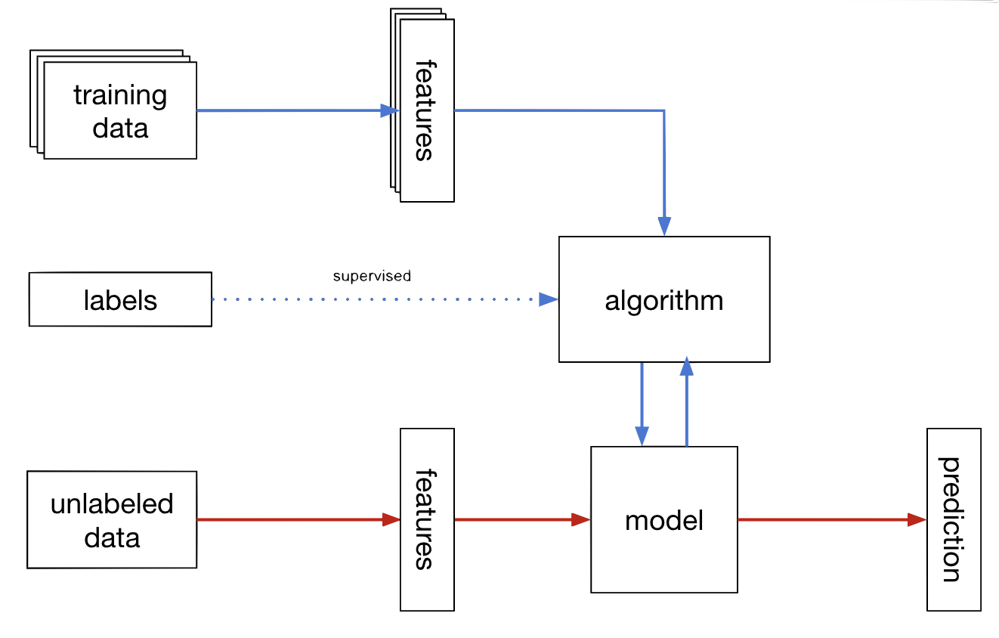
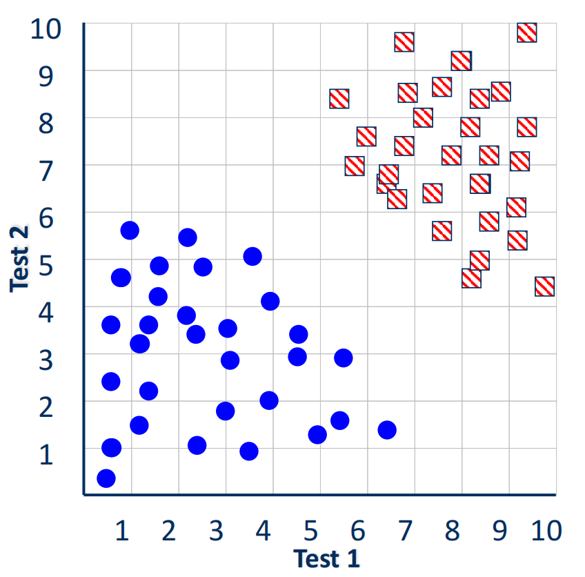
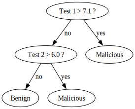
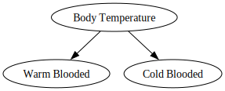
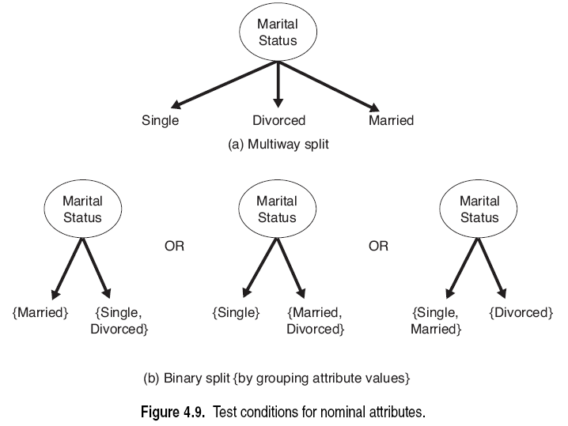
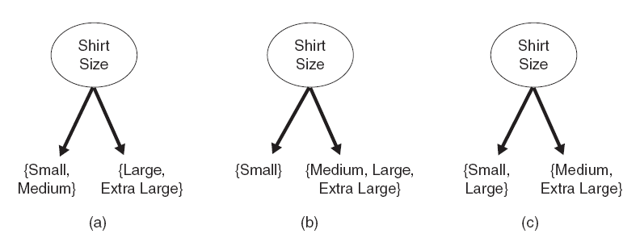
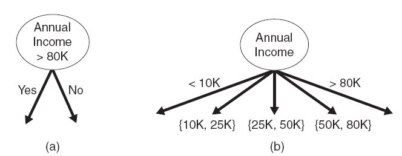

# L8 - Classification 1: Decision Trees and Logistic Regression

**Classification**:

- Input: Data representing objects that have been assigned labels
- Goal: Accurately predict labels for new (previously unseen) objects

**Typical Applications**:

- Credit Approval
- Target Marketing
- Medical Diagnosis
- Treatment Effectiveness
- Identity Fraud Detection

**General Approch to Classification**:

- Training Set: Consists of records with known class labels
- Classification Model: Applied to the test set that consists of records with unknown class labels

**Example: Tumor Classification**:

| Patient ID | Test 1 | Test 2 | Tumor Class |
| ---------- | ------ | ------ | ----------- |
| 1          | 2.7    | 5.5    | Benign      |
| 2          | 8.0    | 9.1    | Malicious   |
| 3          | 0.9    | 4.7    | Benign      |
| 4          | 1.1    | 3.1    | Benign      |
| 5          | 5.4    | 8.5    | Malicious   |
| 6          | 6.4    | 1.3    | Benign      |
| 7          | 6.1    | 6.6    | Malicious   |
| 8          | 0.5    | 1.0    | Benign      |
| 9          | 8.3    | 6.6    | Malicious   |
| 10         | 8.1    | 4.7    | Malicious   |

- Two Features: Test 1, Test 2
- Two Classes: Benign, Malicious

**Decision Tree**:

- A flow-chart-like tree structure
- Internal node denotes a test on an attribute
- Branch represents the outcome  of the test
- Leaf nodes represent class labels or class distribution

**Classification by Decision Tree Induction**:

The decision tree generation consists of two phases:

1. Tree construction
   1. At start, all the training examples are at the root
   2. Partition examples recursively based on selected attributes
   3. All examples that satisfy the condition on the selected attribute move to that branch
2. Tree pruning
   1. Identify and remove branches that reflect noise or outlers

Classifying and Unknown Sample:

- Test the attribute values of the sample against the decision tree

**Splitting Methods**:

- Binary Attributes:

  

- Nominal or Categorical Attributes

  

- Splitting Methods

  - Ordinal Attributes:

    

  - Continuous Attributes:

    

    - Sort the attribute values in ascending order
    - Try Splitting at each position where the class label changes

**Choice of Attribute**:

**Impurity**:

- Defination: A split is pure if, after the split, for all branches, all the examples choose a branch belong to the same class
- We want many items in our sets
- Many different purity measures
  - Information Gain (IG): It measures the reduction in entropy by splitting a dataset according to a given value of an attribute
  - Gini Index

**Entropy**

- Entropy quantifies how much information there is in a random attribute

- The exceed information (entropy) need to classify an example in our training dataset $D$ is defined as
  $$
  \text{Info}(D) = -\sum_{i=1}^m p_i \log_2(p_i)
  $$
  where $m$ is the number of classes, and $p_i$ is the probability that an example in $D$ belongs to class label $C_i$
  $$
  p_i = \frac{|C_{i,D}|}{|D|}
  $$
  where $C_{i,D}$ are the examples in $D$ that belong to class $C_i$

- Information Theory: Enropy is the minimum number of bits needed to encode the class label of an example. E.g. if we have two classes, we can use two bits:

  | Class A | Class B |
  | ------- | ------- |
  | $1$     | $0$     |

- So if all examples are of class A, what is the entropy?

  - Probability of class A: $p_1 = 1$
  - Probability of class B: $p_2 = 0$

  $$
  \text{Info}(D) = -1\times\log_2(1)-0\times\log_2(0) = 0
  $$

  Makes sense. If all classes are of the same label, there is no need to encode anything.

- What if half of the examples are of class A and half are class B?

  - Probability of class A: $p_! = 0.5$
  - Probability of class B: $p_2$ = $0.5$

  $$
  \text{Info}(D) = -0.5\times\log_2(0.5)-(-0.5)\times\log_2(0.5) = 0.5+0.5=1
  $$

  Makes sense. This is the most not-pure setting. We need $1$ bit per class (0 or 1).

**Information Gain**:

- Attribute A is chosen for a split

- $D$ is split into $v$ partions based on $A$: $D_1$, $D_2$, $\cdots$, $D_v$

- Information needed to classify $D$:
  $$
  \text{Info}_A(D) = \sum_{j=1}^v\frac{|D_j|}{|D|}\text{Info}(D_j)
  $$

- Information gained by branching on attribute $A$:
  $$
  \text{Gain}(A) = \text{Info}(D) - \text{Info}_A(D)
  $$

**Gain Ratio**
$$
\text{Gain Ratio} = \frac{\text{Gain}(A)}{\text{Splitinfo}}
$$

- A modification that reduces its bias on high-branch attributes:
- Gain ratio should be:
  - Large when the number of branches is small
  - Small when the number of branches is large
- Takes the number and size of branches into account when choosing an attribute
- Corrects the gain by using splitinfo:
  - Taking the information of a split into account
  - i.e. how much info do we need to tell which branch an example belngs to

**Algorithm for decision tree induction**:

- Basic Algorithm (a greedy algorithm):
- Conditions for stopping the partitioning

**Pros and Cons of Decision Trees**

- Pros:
  - Reasonable Training Time
  - Fasr Application
  - Easy to Interpret
  - Easy to Implement
  - Can handle many features
- Cons
  - Cannot handle complicated relationships between features
  - Simple decision boundaries
  - Problems with lots of missing data
  - NP-complete

**Extracing Rules**

Convert Decision Trees to Rules

**Logistic Regression**

- The logistic regression algorithm finds the best logistic function that can describe the relationship between two variables
  - Dependent variable $y$ (class variable)
  - Independent variable(s) $x$ (Data Variables)
- Classic Logistic Regression
  - $y$ is binary
  - Label classes as either $1$ or $0$

**Computing the Odds**

...

**Odds Ratio**

- Odds refer to the ratio 