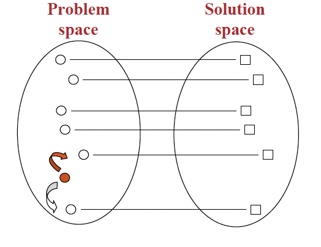
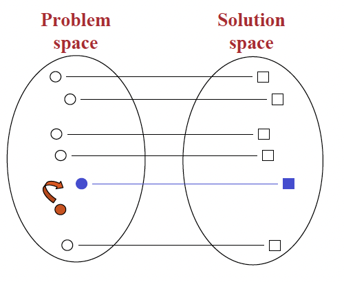
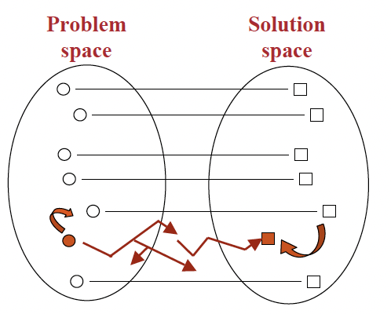
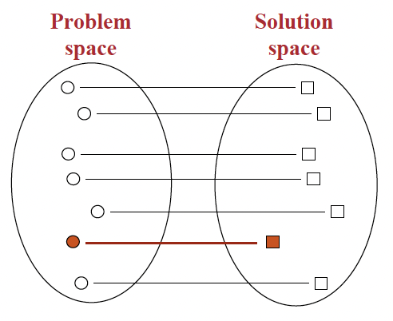
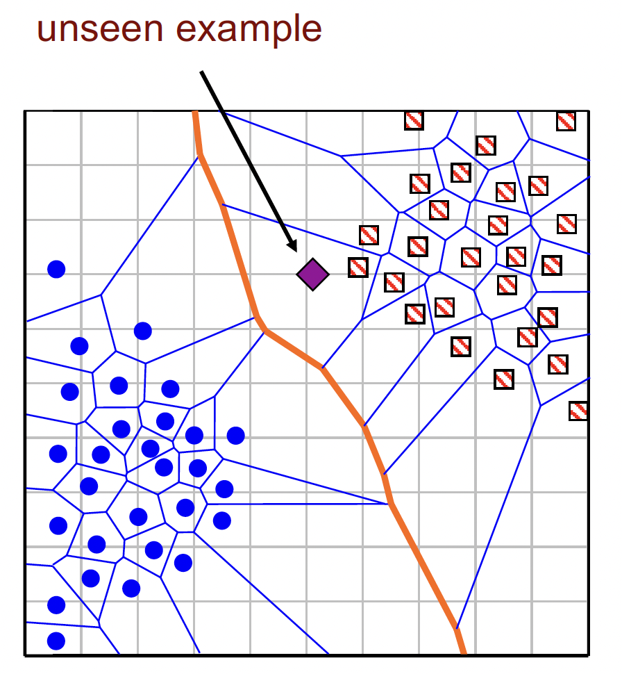
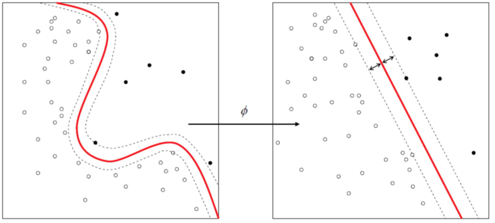
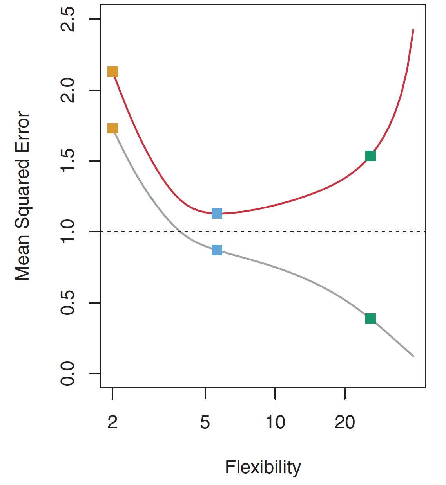

# L9 - Classification 2: KNN, SVM, and evaluation metrices

## Eager Learning vs Lazy Learning

### Classification Recap

- Classification: A supervised machine learning method, where the model predict the correct label.
- The data is fully trained using the training data, evaluated on test data before being used to perform prediction on new unseen data.
- Classification Recap: An algorithm to learn to predict whether a given email is spam or not.
- Different Learning Methods: Eager Learning, Instance-based (Lazy) Learning

### Eager Learning

Construct general explicit description of the target function, based on the provided training examples.

### Lazy Learning

Simply store the data and generalizing beyond, postponed until an explicit request is made.

#### Process

1. Search the memory for similar instance
2. Retrieve the related solutions
3. Adapt the solutions to the current instance
4. Assign the value of the target function estimated for the current instance

### Eager vs. Lazy Learning

| **Aspect**                | **Lazy Learning**                                                                                  | **Eager Learning**                                                                                         |
|---------------------------|----------------------------------------------------------------------------------------------------|------------------------------------------------------------------------------------------------------------|
| **Function Approximation** | Constructs a different approximation to the target function for each query instance.               | Uses the same approximation for the target function, which is pre-learned from training data.               |
| **Timing of Learning**     | Postpones generalization until a query is encountered (query-driven learning).                     | Generalizes before seeing any queries, during the training phase (model-driven learning).                    |
| **Suitability**            | Suitable for complex and incomplete problem domains with a need for local approximations.           | More appropriate for well-defined problem domains where the global approximation can be learned beforehand.  |

## The Nearest Neighbor Classifier

### K-Nearest Neighbor Classification (KNN)

- Non-parametric
- Lazy learning algorithm
  - Training fast
  - Lack of generalization: KNN keeps all the training data.
- Purpose: Predict the classification of a new sample point

#### $1$-NN

Decision Boundaries: Surfaces that simply divide the space info regions belonging to each instance.

For $1$-NN it's the Voronol Diagram of the training set.

#### $k$-NN

- $1$-NN is sensitive to outliers, solution: $k$-NN classifier
- $k$ should be an odd number

#### Steps

1. Find the $k$ training examples with attributes relatively similar to the attributes of the test example ($k$-nearest neighbors)

#### Normalization

##### Min-Max Normalization

$$
x' = \frac{x-\min(x)}{\max(x)-\min(x)}
$$

e.g. minimum value is $20$, maximum value is $40$, then $30$ would be transformed to about $0.5$ 

##### Standardization (Z-score Normalization)

$$
x' = \frac{x-\overline{x}}{\sigma}
$$

## Support Vector Machine (SVM)

- Solves classification and regression tasks
- Particularly good at solving binary classification problems
- Principle: find the best possible line (decision boundary) that separates the data points of different data classes
- Hyperplane (超平面？): The boundary mentioned above
- Idea: Maximum the margin
- Application: Useful for analysing complex data, which aren't easy to be separated by a simple straight line.

### Linear SVM

Margin: Defined by two points (one from "+" set and the other from the "-" set)

### The maximum margin hyperplane

- Choose
  - The hyperplane that represents the largest separation, or margin, between the two classes.
  - Distance from it the nearest data point on each side is maximized.
  - If such a hyperplane exists, it is known as the **maximum-margin hyperplane**
- Necessary for linear classification
  - This ensures that their worst case generalization errors are miminized.

### Linear Support Vector Machines

- Usage: Find the maximum-margin hyperplane

- Express: linear combination of the data points $(x_i, y_i)$

  $$
  f(x) = \sum_{i}k_i y_i<x_i, x> +b
  $$

- When not linearly separable: Define a mapping $\phi(x)$ that maps each attribute of point $x$ to a new space where points are linearly separable.

  

  - Original: $f_{\text{origin}}(x) = <w,x> + w_0 = \sum_{i} k_iy_i<x_i, x> + b$
  - New: $f(x) = \sum_{i}k_iy_i<\phi(x_i), \phi(x)> + b$

#### Kernal

- Assume two points $x_1 = (a_1, a_2)$ and $x_2=(b_1, b_2)$

- Kernal Function: $K(x_1, x_2) = <\phi(x_1), \phi(x_2)>$

- Choose:

  | Kernal Type         | Kernal Function              |
  | ------------------- | ---------------------------- |
  | Linear (dot) Kernel | $K(x_1, x_2) = <x_1, x_2>^1$ |
  | Polynomial Kernal   | $K(x_1, x_2) = <x_1, x_2>^d$ |

## Evaluation Metrics

- Training Set $\{x_1, x_2, \cdots, x_n\}$

- Classes of the training set $\{y_1, y_2, \cdots, y_n\}$

- Mean squared error (MSE):
  $$
  \text{MSE} = \frac{1}{n}\sum_{i=1}^n(y_i-\hat{f}(x_i))^2
  $$
  in which $\hat{f}(x_i)$ is the predicted value of $x_i$

### Overfitting and the U-Shape Effect

Grey Line: MSE on the training set

Red Line: MSE on the test set

Training error alwats reduces as models become more complex

Test error forms a U-shape

### Bias and Variance ?

#### Variance

- **Definition**: Variance measures how much a model’s performance changes when trained on different training datasets.
- **Ideal Scenario**: Ideally, the model’s predictions should not vary much across different training sets. This would indicate that the model is stable and generalizes well.

#### Flexible Classifiers and Variance

- **Effect**: Classifiers that are more flexible (i.e., can fit complex patterns) tend to have **higher variance**. This means their performance is more sensitive to the specific data used for training.

- **Risk**: High variance can lead to overfitting, where the model learns not just the patterns in the data but also the noise or errors, making it perform poorly on unseen data.

- Variance: How much would the model change (in performace on test set) if we use a different training set.

- Ideally: The estimate of $f$ should not vary too much among different training sets.

- Flexible Classifiers have higher variance, may cause the model to learn noise or errors, hence overfitting.

- Bias: A learner's tendency to "under-learn" the data due to erroneous assumptions.

  

- Error introduced by using a simpler model to learn a complex relation 

- High bias may cause the model to miss important relations between the attributes and class labels, hence underfitting

- Ideally: The estimate of 𝑓 should have a low bias 

- Flexible classifiers have lower bias

### Metrics for Performance Evaluation

Focus on the predictive capability, rather than speed, scale etc.

#### Confusion Matrix

|          | Positive                           | Negative                           |
| -------- | ---------------------------------- | ---------------------------------- |
| Positive | True Positive (TP)                 | False Negative (FN) (Type 2 Error) |
| Negative | False Positive (FP) (Type 1 Error) | True Negative                      |

#### Accuracy, Precision and Recall

$$
\begin{aligned}
\text{accuracy} &= \frac{\text{TP}+\text{TN}}{\text{TP}+\text{TN}+\text{FP}+\text{FN}} \\
\text{precision (class = YES)} &= \frac{\text{TP}}{\text{TP}+\text{FP}} \\
\text{precision (class = NO)} &= \frac{\text{TN}}{\text{FN}+\text{TN}} \\
\text{recall (class = YES)} &= \frac{\text{TP}}{\text{TP}+\text{FN}} \\
\text{recall (class = NO)} &= \frac{\text{TN}}{\text{FP}+\text{TN}}
\end{aligned}
$$
